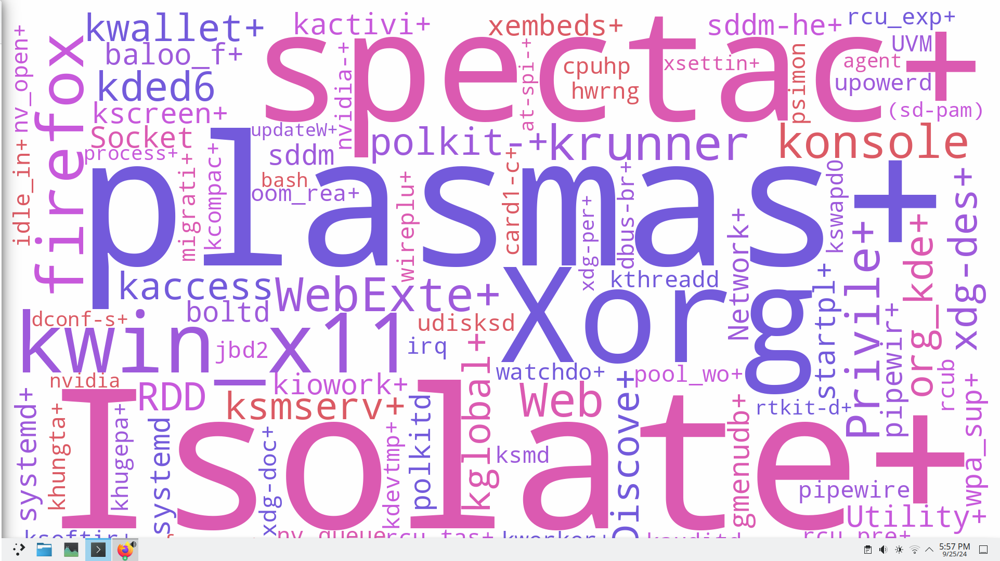
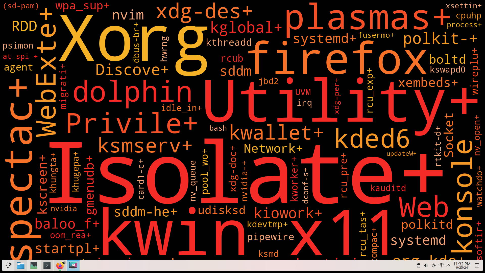

# Process Wallpaper

Python and shell scripts that dynamically set your wallpaper to a word cloud of the most resource-intensive processes currently running.

  
*Colors used in the wallpaper:
"background": "#FEFEFE"
"colors": ["#9E5ADB", "#DB5AB1", "#C759DB", "#735ADB", "#DB5A64"]*

  
*Colors used in the wallpaper:
"background": "#010101"
"colors": ["#F54F27", "#F59727", "#F57228", "#F52B27", "#F5B227", "#F5A679"]*

## Dependencies
- **General:**
  - `python`
  - `xrandr`
  - `python-matplotlib`
  - `python-wordcloud`

- **KDE:**
  - `plasmashell`

- **GNOME:**
  - `gsettings`

- **Lightweight Distros (e.g., i3, Openbox):**
  - `feh`

> **Note:** If none of the automatic methods work, you can manually set the generated `wallpaper.png` as your wallpaper.

## What's New?
I simplified the setup process, as I found it unnecessarily complex when configuring it myself. Now, the entire process is automated with just one command to make it easier for everyone.

- **Custom Color Palette Support:** The Python script now allows you to customize the word cloud color palette via the configuration file.
- **Configurable Wallpaper Timer:** The `config.json` file now includes a timer to control how frequently the wallpaper updates.
- **Automated Systemd Service Setup:** The `setup.sh` script now creates a `.service` file in your user directory. If the service is already running, it will automatically restart with updated settings.
- **Process Automation:** A new bash script handles the background process and depends on `updateWallpaper.sh` and `setWallpaper.sh`.
- **Detailed Logging:** The log file (`/tmp/wallpaper.log`) now includes detailed logs at key points in the process for easier debugging and monitoring.
- **Automatic Wallpaper Updates:** Any changes made to `config.json` will automatically trigger a wallpaper update—no need to rerun the setup script.
  > **Note:** If the changes are not reflected immediately, wait until the next iteration of the timer.

## Setup Instructions
1. Clone the repository:
    ```bash
    git clone git@github.com:Zama15/process-wallpaper.git
    cd process-wallpaper
    ```

2. Run the setup script:
    ```bash
    ./setup.sh
    ```

> Once installed, the wallpaper will automatically update based on the processes running on your system.

